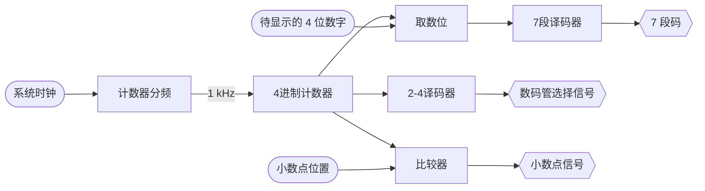
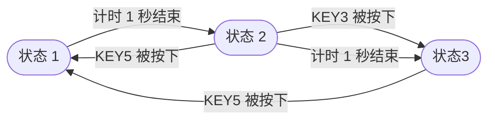
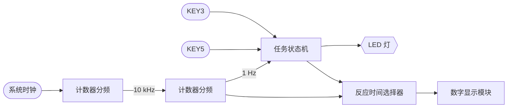

# 数字逻辑与处理器基础实验 实验报告

> 实验二：反应速度测试仪的设计
>
> 无 13 管思源 2021012702

## 实验目的

- 掌握简单的组合和时序电路综合设计方法
- 掌握数码管动态显示方法
- 掌握 Verilog 层次化建模方法

## 设计方案

分两步实现指导书要求的功能：先将任意 4 位数字显示在数码管上，再设计顶层模块实现任务流程和计时功能。

### 任意 4 位数字的显示

#### 设计思路

根据课上提示，我们以 1ms 的间隔循环遍历 4 个数码管，依次设置`sel[3:0]`、`seg[6:0]`和`dp`，即可实现动态显示。

我们创建`display_number`模块，输入为

- `clk`：时钟信号（使用系统时钟）
- `num[13:0]`：待显示的 4 位数字（0至9999）
- `dpn`：小数点位置（最左侧为 0，最右侧为 3）

输出为

- `sel[3:0]`：数码管选择信号
- `seg[6:0]`：7 段码
- `dp`：小数点信号

模块内需要实现以下功能

- 1ms 为周期的时钟，即 100000 倍计数分频器（系统时钟为 100MHz）
- 4 个数码管的循环遍历，即一个 4 进制计数器（包括数码管选择信号和小数点信号的设置）
- 4 位数字到每位数字7段码的转换，可以使用取模操作和实验一提供的`BCD7`模块

#### 原理框图

### 顶层模块的设计

#### 设计思路

指导书描述了系统的三个状态：

1. 系统启动后或按下 KEY5 复位后计时 1 秒
2. LED 亮，等待 1 秒 KEY3 被按下
3. LED 灭，显示 LED 亮到 KEY3 被按下的时间（反应时间）

据此我们设计有限状态机，以下是状态转移图：

有限状态机（即顶层模块）的输入为

- `clock`：时钟信号（使用系统时钟）
- `key3`：KEY3 按键信号
- `key5`：KEY5 按键信号

输出为

- `led[0]`：LED 灯信号
- 4 位数码管的显示信号

对于顶层模块，我们需要实现以下功能

- 0.1ms 为周期的时钟，用于测量反应时间，可以使用系统时钟进行 10000 倍计数分频
- 1s 的计时器供状态转移使用，可以在 0.1ms 时钟基础上进行 1000 倍计数分频
- 任务状态机，实现状态转移（包括按键检测和 LED 显示）
- 四位反应时间的显示，可以使用前面设计的`display_number`模块

#### 原理框图

### 注意事项

- 计数器不使用取模操作（消耗硬件资源较多），而是判断到达了计数值后重置
- 注意数码管的左右顺序，`sel`低位对应左侧数码管，对应要取数字的千位
- 在状态 3 中，我们需要保留反应时间，因此需要来自状态机的控制信号使计数器不再累加

## 综合结果与分析

### 硬件资源使用情况

如图所示，使用了 193 个 LUT 和 59 个寄存器。其中，数字显示模块使用了 174 个 LUT 和 28 个寄存器，顶层模块自身使用了 19 个 LUT 和 31 个寄存器。

数字显示模块使用的 LUT 占绝大部分，这是因为数字取位和7段译码的逻辑较为复杂；而顶层模块自身使用的寄存器更多，这是由于两个计数分频器用到的位数较大。

### 静态时序分析结果

一开始，我先进行了综合，然后在综合设计中添加时钟进行静态时序分析。以下是我得到的结果：

可以看到建立时间不满足时钟要求，有四条路径的总延时超过了 10 ns。我们进一步查看延时最大的一条路径，如下图所示：

这条路径从`state`寄存器出发，经过多层 LUT，最后到达`digit`寄存器。可以看出，路径中大部分延时和 LUT 都用于计算`digit`，这与耗时的数字取位操作相符。

在我尝试优化逻辑达到时钟要求的过程中，我（为了节省时间）在硬件约束文件中添加了时钟约束，并无意间用没有任何改动的代码进行综合。

结果是出乎意料的（如下图所示）：

综合后竟满足了时钟要求！

对比在硬件约束文件中添加时钟约束前后、关键路径的线延时和逻辑延时的差异，我们发现在添加时钟约束后逻辑延时并没有明显变化，而线延时却从 9 ns 左右下降到了 6 ns 左右。因此，我认为这是因为 Vivado 在综合时会根据时钟约束来优化布局布线，来尽可能满足时钟要求。

> 老师在课上提到可以使用 4 个 10 进制计数器串联来避免取位操作，这的确是很好的设计/优化思路。但是，一方面出于模块泛用性和调试便利的考虑，我在设计方案时决定将 4 位数字显示功能模块化，希望能接受任意的 4 位整数；另一方面因为设计已经满足了时钟要求，所以没有采用这种优化办法。

## 关键代码及文件清单

### 代码文件（按模块例化结构）

- `top.v`：顶层模块，包含任务状态机和毫秒计时器
  - `display_number.v`：数字显示模块，将 4 位数字显示在数码管上
    - `BCD7.v`：BCD 码转 7 段码模块，同实验一提供的代码

### 其他文件

- `constraint.xdc`：硬件约束文件
- `top.bit`：生成的比特流文件，可直接烧写到开发板
- `img/*.png`：综合结果截图
