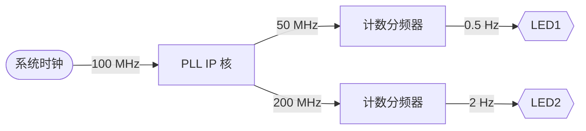

# 数字逻辑与处理器基础实验 实验报告

> 实验四：Vivado 中 IP 核的应用
>
> 无 13 管思源 2021012702

## 实验目的

- 理解IP核的用途，初步掌握IP核的使用方法
- 学会利用IP核设计数字电路
- 通过与手写模块的对比，初步理解使用IP核的优点

## 设计方案

按照指导书的说明，先构建好 PLL IP 核。

在此基础上，我们只需要实现 100,000,000 倍的计数分频器就可以满足实验要求。需要注意的是，为了能正常控制 LED 灯，分频器的输出信号占空比应为 50%

以下是系统的原理框图：

以下是系统的模块结构

## 仿真结果与分析

实验提供了`PLLsim_example.v`仿真测试文件，在构建好 PLL IP 核后，我们直接使用 Vivado 对其进行行为级仿真，结果如下：

可以看到，在 360 ns 时，模块开始输出合成后的频率。随后在 560 ns 处，模块的`locked`信号变为高电平，表明 PLL 已经成功锁频。

值得注意的是，在 100 ns 附近`clk_out1`和`clk_out2`也输出了高电平。同时，在 PLL 锁频之前的频率输出不一定可靠。因此，我们在使用时应该将`clk_out && locked` 作为时钟信号，或将`reset || !locked` 作为复位信号，以避免错误的时钟信号。

## 综合结果与分析

### 硬件资源使用情况

如图所示，系统使用了 26 个 LUT 和 56 个寄存器。除此之外，系统还使用了一个 PLL，这是 FPGA 的硬件资源之一，专门用于频率合成。

显然，这是 PLL IP 核所使用的。我们可以点开综合后的系统框图确认这一点：

可以看到`clk_wiz`IP 核模块用到了名为`plle2_adv_inst`的硬件模块，其端口定义于与我们在定制 IP 核时所看到的一样。

### 静态时序分析结果

结果显示，系统已满足时钟约束，其中建立时间有 1.701 ns 的裕量。

等等，我们只进行了计数分频，为什么裕量只有这么小呢？我们可以进一步查看建立时间裕量最小的几条路径，如下图所示：

可以发现它们都处于 200 MHz 时钟范畴内，要求延时在 5 ns 以内，因此虽然它们延时都在 3 ns 以内，但是裕量的绝对值较我们之前遇到的案例更小。这也说明 Vivado 正确地处理了系统内衍生的不同时钟，不会只按照硬件约束文件中描述的时钟进行分析。

对于这种系统内有多个时钟的情况，我们还可以查看时钟之间的关系，如下图所示：

其中两个绿色块代表两个时钟范畴内的时间约束已满足，而黑色代表没有跨越这两个时钟范畴的路径。

## 关键代码及文件清单

### 代码文件（按模块例化结构）

- `top.v`：顶层模块
  - `divider.v`：计数分频器模块
  - `PLLtop_example.v`：PLL IP 核的例化模块
- `PLLsim_example.v`：PLL IP 核的仿真测试文件
  - `PLLtop_example.v`：PLL IP 核的例化模块

### 其他文件

- `constraint.xdc`：硬件约束文件
- `top.bit`：生成的比特流文件，可直接烧写到开发板
- `img/*.png`：仿真和综合结果截图
